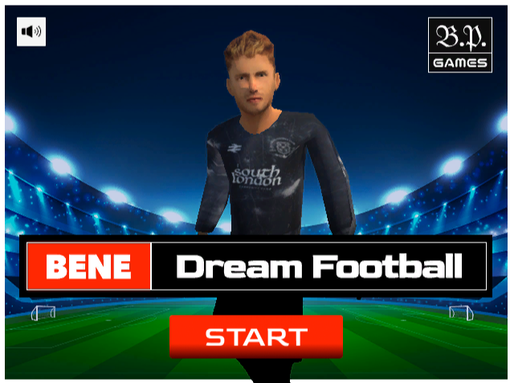
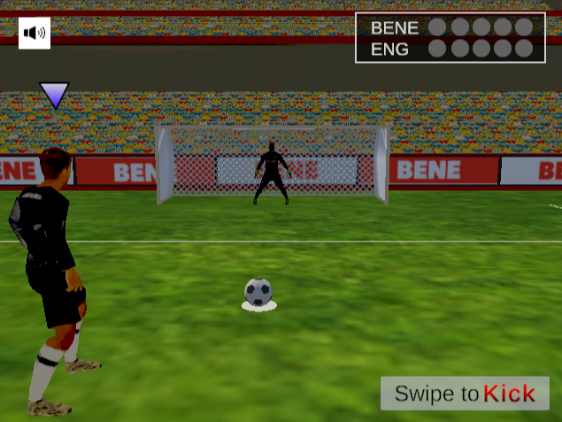
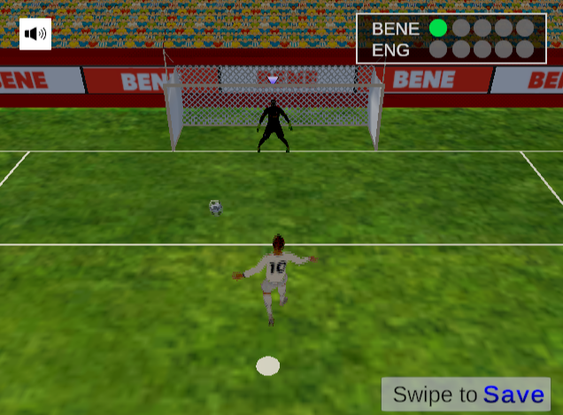
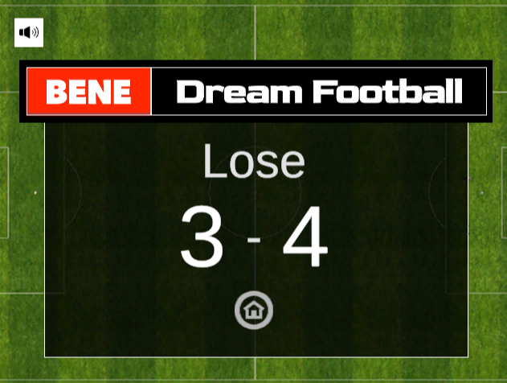
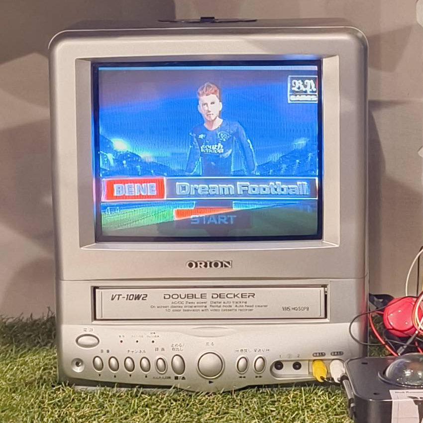
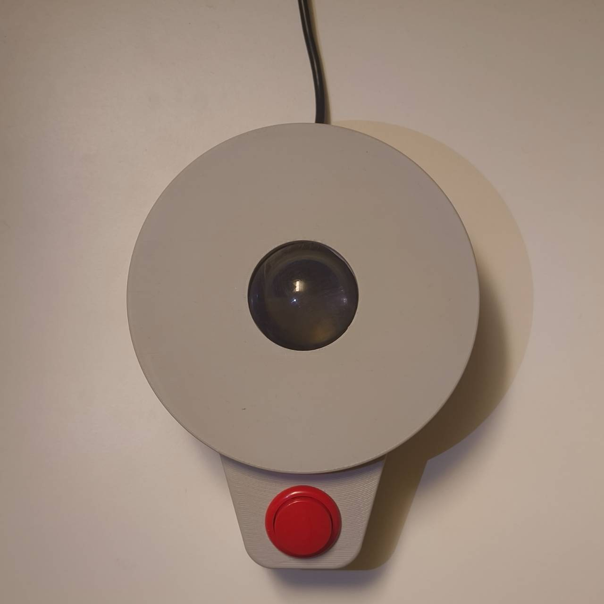
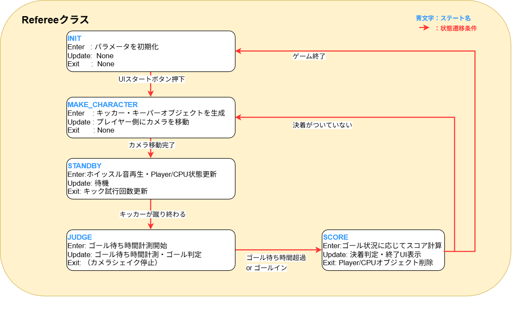
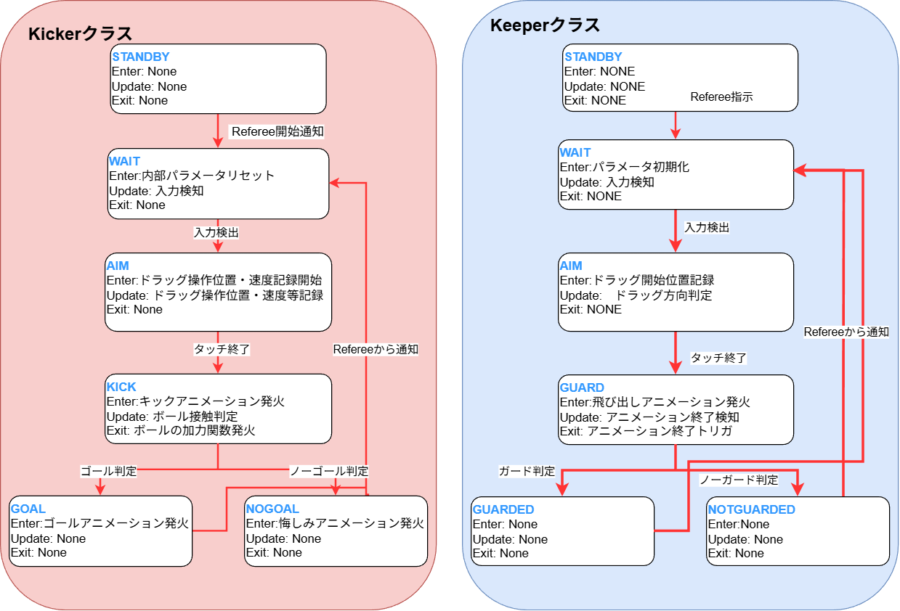

# BENE Dream Football

## 概要
サッカー古着・雑貨を販売するアパレル店舗（2店舗）にて展示したPKゲームです。
プレイヤーはキッカーとキーパーを交互に交代し、CPUと対戦します。

コントローラーとしてトラックボール型コンソールを利用し、直感的な操作でゲームを楽しめます。
PS1風のグラフィックで、テレビデオに接続して遊ぶことで、レトロな味わいがあります。

ゲーム内で操作するプレイヤーの服は実際に古着店舗で販売されているオリジナルウェアを選択でき、
プレイする場所での体験を向上させるゲームとなっています。

## プレイイメージ

### インゲーム画像

#### スタート画面

#### ゲームプレイ画面 （キッカー）

#### ゲームプレイ画面 (キーパー)

#### リザルト画面


### 展示風景

#### 画面

#### トラックボールコンソール


---

## 実行方法・操作方法
実行ファイル/BENE Dream Football.exe を起動

1. マウスクリックでスタート
1. ユニフォームを選択
1. キッカー操作：ドラッグ方向と速度でシュートコースを決定、サークルのタイミングに合わせてシュート速度を決定。
1. キーパー操作：ドラッグ方向で飛び込み方向を決定
1. 勝敗がつくまで繰り返す

※自作のトラックボールコンソール・ディスプレイとしてのテレビデオを使用してプレイする環境に操作感や画面サイズが最適化されています。

※ゲームを起動するとマウスが非表示になるため終了するときはEscキーを押下してください。

---

## 技術スタック

| 項目                  | 内容                                |
|----------------------|-------------------------------------|
| エンジン             | Unity 2021.3.25f1                    |
| 言語                 | C#                                  |
| 対応プラットフォーム | Windows, WebGL                        |

---

## 担当範囲
- ゲームロジック部分のプログラム
    - （bene-game/Assets/02_dev-Game/Scripts/以下のすべて）
- ゲームデザイン・パラメータ調整

---

## 製作期間
- 2025/03/17  作成開始
    - 開発
- 2025/05/10  店舗展示
    - アップデート
- 2025/10/11  店舗展示

---

## ソースコード
[github](https://github.com/black-pomeranian/bene-game/tree/dev-trackball)
※ 最新コードはdev-trackballブランチにあります。

---

## コメント・工夫した点
- 設計観点
    - 展示を何度か繰り返しながらアップデートをしていくために拡張性や再利用性を意識して設計しました。
    - 主要なプログラムはStateパターンという設計デザインパターンに従うようにプログラムを作成しました。
    - それぞれのステートに入った時にはEnter、ステート中はUpdate、ステートを抜けるときはExitの処理が実行されます。
- 実装観点
    - ゲームのおもしろさを最大限に引き出せるアルゴリズムを検討しました。
    - 特にトラックボールコントローラーの入力値のゲームへの反映方法の工夫に注力しました。

### 設計観点
#### Refereeクラス
- Refereeというゲーム全体の流れを制御するプログラムです。

- INIT, MAKE_CHARACTERなどの5つのステートを持っています。
- ゲームの流れをステートで管理することによって各段階で行うべき処理や流れを明確にしています。
- ゲーム全体で管理すべきデータ（スコアやターン数、ゴールフラグ）と各オブジェクト（キッカーやキーパー）が持つべきデータの責務を明確に分割できるようにしています。

#### Kicker/Keeperクラス (親クラス)
- Kicker、Keeperというそれぞれのモデルを制御するための親クラスです。（親クラス自体はマウス操作に対応）
    - TrackBall操作に対応したKickerTrackBallとKeeperTrackBall、CPUのKickerCPUとKeeperCPUをこれらの親クラスを継承して作成しました。

- それぞれが6つのステートを持っています。
- 明確なステート管理することによって、効果音の追加やアニメーション発火など後から任意のタイミングに演出を加えることが容易になりました。
- 親クラスを継承し、AIMステートのEnterやUpdate処理のみをオーバーライドしてTrackball操作アルゴリズムやCPUアルゴリズムへ変更することで容易な機能追加が可能です。

### 実装観点
- トラックボールコントローラーを使った直感的な操作感になるようなシュートアルゴリズムを工夫しました(Assets/02_dev-Game/Kicker/KickerTrackBall.cs:UpdateAimState()関数)
- 以下、コードの順に従って説明します。（ただし、キッカーから見たそれぞれの座標方向は右方向 ( X = -1 ), 上方向 ( Y = 1 ), 前方向(Z = -1)）
    - トラックボールからは通常のマウスと同じように X 軸・Y 軸の移動量が取得できます。
    - 変化量はそのまま使わず、累積ベクトル（accumulatedDelta）として累積し、ユーザーが一定距離以上トラックボールを転がしたときの累積の変化量を利用して、シュート方向を決定します。
    - この X,Y の累積変化量を3D空間のXZ平面（地面）にマッピング、キッカーから見た前方向になるよう符号反転して入力方向ベクトル(inputDir)とします。
    - (キッカー前方向、Z=-1)を0°とし、回転軸を（上方向、Y=1）としたときの3次元ベクトルinputDirの角度を、SignedAngle関数の返り値から（-180°~180°）の範囲で得ます。(inputAngle)
    - この入力角度inputAngleを入力の制限角度範囲(inputAngleRange)で（-1 ~ 1）の範囲に正規化します。(normalized)
        - inputAngleRangeの範囲外（トラックボールを大きく左右や後ろ側に転がしたときの失敗操作時など）の場合は-1 もしくは 1 になります。
    - 正規化された値（normalized）に3次元ゲーム空間内での最大シュート角度 ( maxAngle ) をかけることで、ゴールネットの範囲にシュート角度をマッピングします(mappedAngle)。
        - ただし、正規化された値が normalized = -1, 1 の場合には、ゴール外のシュート角度となるようにmaxAngleの値を調整しています。
    - 以上の処理で、トラックボールの入力をシュートコースの角度にマッピングし、直感的に狙いを定められるような操作感を実現しました。
    - また、経過時間と移動量から トラックボールの回転速度（swipeSpeed）を計算し、高さ（heightFactor）として反映することで、「素早く回すとゴールネット上方向を狙う」という、キック操作にしています。
        - これはゴールネット上側の角を狙うとゴールが入りやすいが、勢いよくトラックボールを回すと狙いを定めにくいという駆け引きを生んでいます。
    - シュート方向のベクトルには最後に強さを（timingMultiplier）を掛けています。この大きさはゲーム上でループアニメーションで拡大・縮小されているサークルＵＩの大きさに比例しており、このタイミングによってシュートの勢いを決定することでゲームとしての駆け引きを生んでいます。
    - これらの処理により、トラックボール操作に最適化された、直感的なシュート方向の決定、何度もプレイしたくなる駆け引きのあるゲーム性を実現しています。

```C#:KickerTrackBall.cs
// AIM状態の更新
    protected override void UpdateAimState()
    {
        Vector2 delta = new Vector2(Input.GetAxis("Mouse X"), Input.GetAxis("Mouse Y"));
        accumulatedDelta += delta;

        UpdateTiming();

        if (accumulatedDelta.magnitude > moveThreshold)
        {
            float elapsed = Time.time - swipeStartTime;
            float swipeSpeed = accumulatedDelta.magnitude / (elapsed + 0.001f);

            Vector3 inputDir = new Vector3(-accumulatedDelta.x, 0, -accumulatedDelta.y);

            float inputAngle = Vector3.SignedAngle(Vector3.back, inputDir.normalized, Vector3.up);
            float normalized = Mathf.Clamp(inputAngle / inputAngleRange, -1f, 1f);
            float mappedAngle = normalized * maxAngle;

            Vector3 direction = Quaternion.Euler(0, mappedAngle, 0) * Vector3.back;

            float heightFactor = Mathf.Clamp(swipeSpeed * heightSensitivity, minHeight, maxHeight);
            float timingMultiplier = GetTimingMultiplier();

            aimVector3 = new Vector3(direction.x, heightFactor, direction.z) * timingMultiplier;

            ChangeState(KickerState.KICK);
        }
    }
```

